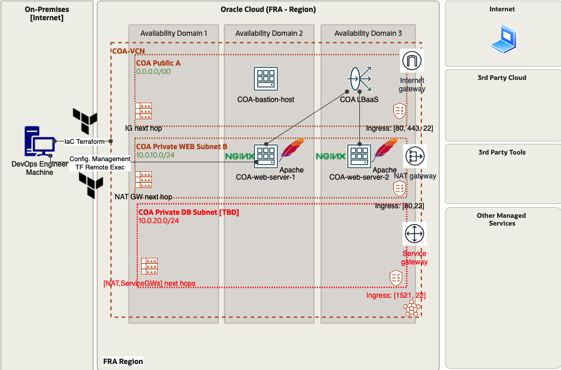

# COA DevOps Training UseCase
This project provides the documentation and the automation(code) for the Oracle EMEA WLA COA Demo UseCase.

We're going to showcase, by following a realistic usecase, the following:
* a recomended teraform demo template
* abstracting terraform configuration
* best practices around: code, project structure, data structures, optional configuration, functions and many more
* we'll drive you through a few operations scenarios use-cases that cover both IaC and configuration management.

## Demo environment arhitecture diagram



## Demo Usecase scenario

In this example a DevOps engineer will leverage an IaC and Configuration Management automation to: 
* provision the following OCI Infrastructure:
    * Networking:
        * one VCN and 2 subnets(private and public)
        * coresponding security rules
        * Internet and NAT GW
        * Routing rules
    * Compute:
        * one bastion host VM instance exposed on the public subnet
        * A configurable number of WEB Servers exposed to the private subnet
    * LBaaS:
        * A load balancer, exposed to the public subnet, containing:
            *  backend set containing:
                * a configurable number of backend servers 
            * a configurable number of listerners with SSL/no-SSL option
* running the folloiwng configuration(terraform remote exec provider) on the provisioned VMs:
    * on bastion host:
        * upload the private ssh_key to access the backend webserver VMs
    * on the WEB Server VMs:
        * configure ```iptables``` to open port 80
        * install NGINX or Apache webserver, configure them to listen on port ```80```, upload a custom ```HTML``` page and start the servers.

On this topology we'll be able to demostrate the operations described bellow.

## Demo automation supported operations

* Infrastructure provisioning
* Configuration management
* Include configuration into the terraform dependency graph(install/uninstall) - TBA
* Change management system - ex. open port
* SSH public key rotation 
* LBaaS Certificate rotation
* Cluster Scale Up/Down

## Terraform project design and best practices
This automation example is meant to also cover a set of terraform coding example and best practices and provide some stardardisation of how a terraform project should be structured.
* [Best Practices](Best%20Practices.md)

